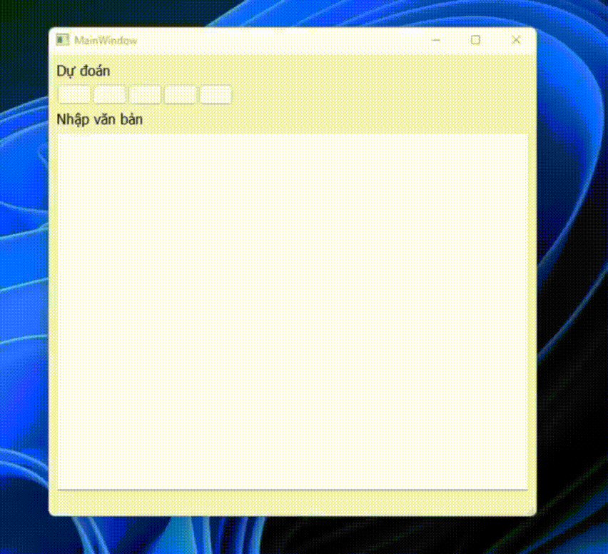

# PTUD_XLNNTN
bài tập lớn môn phát triển ứng dụng xử lý ngôn ngữ tự nhiên
______________________________________________________________________
Chương trình ứng dụng hỗ trợ viết văn bản Tiếng Việt

người thực hiện:
  - Lê Khắc chiến
  - Nguyễn Hoàng Nam    gmail: namhoangit25@gmail.com

## Mô tả phần mềm
với phần mềm hỗ trợ viết văn bản tiếng việt người 
dùng có thể nhập vào một đoạn văn chương trình sẻ dự đoán từ tiếp theo và 
đưa gợi ý cho người dùng, người dùng có thể sử dụng những từ gợi ý để tiết 
kiệm thời giang nhập liệu.

đây là một bài tập về sử lý tự nhiên tôi quan ngại về khả năng ứng dụng của nó !!!

## Tài liệu tham khảo
tôi đã tham khảo các trang này đẻ xây dựng thuật toán của mình, nguyên lý hoạt động thì giống nhau nên mọi nội dung bạn cần biết về nó bạn có thể xem tại đây

Aman Kharwal - https://thecleverprogrammer.com/2020/07/20/next-word-prediction-model/

Phạm Hoàng Anh - https://viblo.asia/p/tao-language-model-de-tu-dong-sinh-van-ban-tieng-viet-E375zxEjZGW